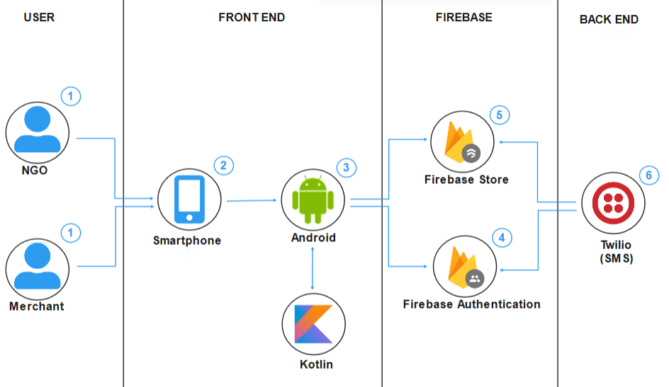
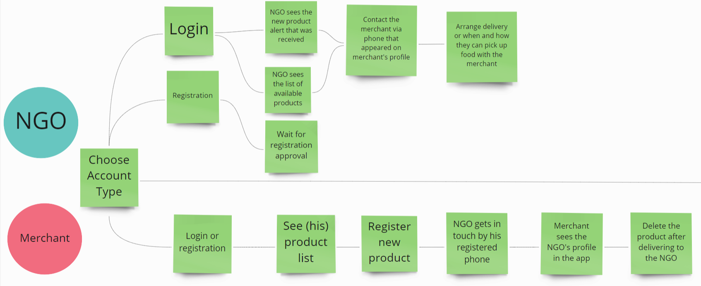

# Food For All App: Zero Hunger

  

<h3 align="center">Welcome to Food For All!</h3>

   

---

Contents 

1. [Introduction](#introduction)
1. [The problem](#the-problem)
1. [Market opportunity](#Market-opportunity)
1. [Our solution](#our-solution)
2. [Demonstration](#Demonstration)
3. [Authors](#authors)

---

## Introduction

__Food For All__ is an app developed for Google Solutions 2022. Our objectives are reduce the food waste and consequently contribute to reduce hunger. The app connects the merchant, who works in supply centers and has to throw away unsold food everyday, and NGOs that fight hunger and help to feed hungry people before the food becomes  unfit for human consumption.

---

## The problem

- More than 820 million people suffer from hunger in the world;
- 127 million tons of food are thrown away each year in Latin America;
- 50 kg of food per person are thrown away each year just in India.

Economic and environment damage are among the consequences of this malfunction in food cycle. Hunger is the biggest consequence. It occurs because, when the food is wasted there is an increase in the value of the products and many families are unable to pay for them. The growth of garbage and environmental problems are also informed by specialists as consequences of those losses. In India, this waste occurs in the following way:
- 40%: In fragmented food systems and inefficient supply chains;
- 20%: In weddings;
- 10%: In retail and supermarket;
- 30%: During sales and supply.

The biggest numbers are caused during transport and handling and during sales and supply, which represent 80% of the causes.

---

## Market Opportunity

We believe that our app will bring more market opportunities because the hunger has always been a concern for many nations, even more today. When we think about our national scenario, which was greatly aggravated by the pandemic. Our app will bring an innovative idea with high chances of helping people who can´t buy or have acess to food.
Food For All:

- Alleviate the hunger that was aggravated by the pandemic;
- Reduce the food waste, that has been a problem for supply centers in Brazil;
- Help NGOs receive more food to help the greatest number of people per day.

---

## Our solution

### Application systematics

1. A merchant at the supply center registers the left over food in the app (in G or KG), takes a photo of the food and informs if this is donated or sold (for a small price informed by him);

2. The app sends notifications to all NGOs; 

3. The NGO access the app and see the announced notification;

4. The interested NGOs contacts the merchant through the telephone number that appears when he/she clicks on "Get it!" and negotiates with the merchant where he/she can get the food;

5. The NGO goes to the merchant and buys or receives the food.

### The Architecture

### Simplified User Flow  

## Demonstration

Click on below Thumbnail to see Demonstration

### Implemented Technologies   

- Kotlin
- Firebase
- Twilio

---

## Authors

* [Ashwith Bhatt](https://github.com/Ashwith2001)
* [Harnish Savsani](https://github.com/HarnishSavsani)

 
---
